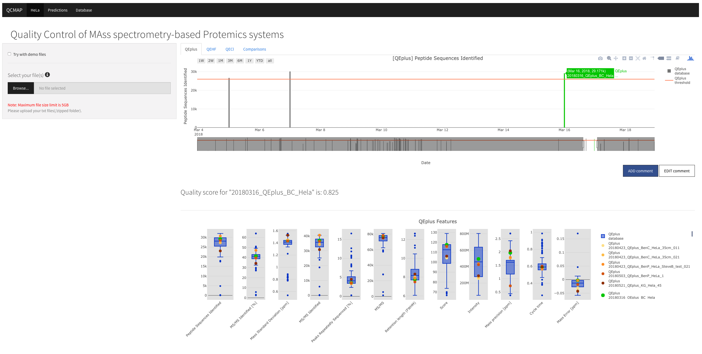
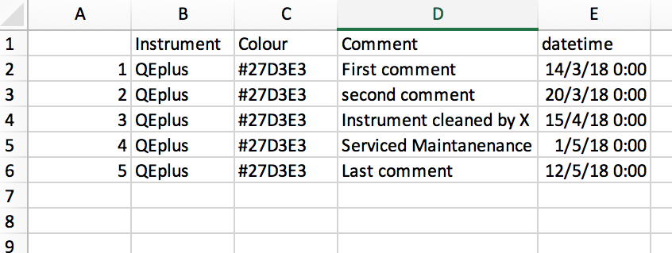
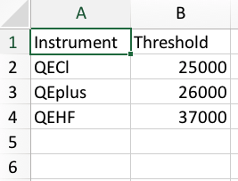

# README #


**Date edited**: 8th June 2018

## 1. What is this repository for? ##
This is a shiny application for Mass Spectrometry (Proteomics) lab at Charles Perkins Centre in University of Sydney.




## 2. How do I set it up? ##


### 2.1 Requirements ###

#### 2.1.1 R Packages ####

* On CRAN

```r
shiny
shinythemes
shinydashboard
ggplot2
plotly
shinyFiles
httr
jsonlite
progress
dplyr
htmlwidgets
colourpicker
shinyTime
rhandsontable
DT
glmnet
```

* GitHub

```r
D3TableFilter (https://github.com/ThomasSiegmund/D3TableFilter)

```

#### 2.1.2 Database

You will need to have database (CSV file) named `allFeatures.csv` that contains summary of the features, instrument details, filenames and dates. An example of the file headers and data is shown below.


**NOTE:** Make sure that the order of your headers are identical to the screenshot provided.

This can be generated using the [R script provided OR "Database" tab of the application at http://shiny.maths.usyd.edu.au/QCMAP/]. In order to create this file from multiple MaxQuant output files, zip the output files by studies and upload multiple zip files to combine them all together to one CSV file.

For example, given a file structure as follows,

```
.
├── study1
│   ├── Oxidation\ (M)Sites.txt
│   ├── aifMsms.txt
│   ├── allPeptides.txt
│   ├── evidence.txt
│   ├── libraryMatch.txt
│   ├── matchedFeatures.txt
│   ├── modificationSpecificPeptides.txt
│   ├── ms3Scans.txt
│   ├── msScans.txt
│   ├── msms.txt
│   ├── msmsScans.txt
│   ├── mzRange.txt
│   ├── parameters.txt
│   ├── peptides.txt
│   ├── proteinGroups.txt
│   ├── summary.txt
│   └── tables.pdf
└── study2
    ├── Oxidation\ (M)Sites.txt
    ├── aifMsms.txt
    ├── allPeptides.txt
    ├── evidence.txt
    ├── libraryMatch.txt
    ├── matchedFeatures.txt
    ├── modificationSpecificPeptides.txt
    ├── ms3Scans.txt
    ├── msScans.txt
    ├── msms.txt
    ├── msmsScans.txt
    ├── mzRange.txt
    ├── parameters.txt
    ├── peptides.txt
    ├── proteinGroups.txt
    ├── summary.txt
    └── tables.pdf

```

Compress **study1** and **study2** as separate zip files as input.


#### 2.1.3 Comments



This is a table provided in the source code named `allComments.csv`. This is where all your comments are going to be stored. The comments are to allow users to indicate or note some changes/updates in the instrument et cetera for all collaborating users. It is to note a message for user to see at certain time point.


#### 2.1.4 **[Optional] Instrument thresholds**

It is possible to include a <span style="color:#ff7f50">threshold line</span> for each instrument in the bar chart. To do this, you will need to have tab separate text file with the name of instrument and the threshold value named `thresholds.txt`. An example of the text file is shown below:



**NOTE:** Make sure that you keep the header and the order of the columns identical to the above screenshot provided.

<br />
### 2.2 Running on local machine


1. Install all required packages and copy all the codes to your directory. **NOTE:** [You will need to create your own `allFeatures.csv` file. OR Replace the `allFeatures.csv` file to use your own database.]
2. Run 'app.R' file
3. Go to 'localhost:PORT_NUMBER' where PORT_NUMBER is the port number displayed on your R console. (e.g. localhost:4000)

**Tested machine**

```r
> sessionInfo()
R version 3.4.2 (2017-09-28)
Platform: x86_64-apple-darwin15.6.0 (64-bit)
Running under: macOS Sierra 10.12.6

Matrix products: default
BLAS: /System/Library/Frameworks/Accelerate.framework/Versions/A/Frameworks/vecLib.framework/Versions/A/libBLAS.dylib
LAPACK: /Library/Frameworks/R.framework/Versions/3.4/Resources/lib/libRlapack.dylib

locale:
[1] en_AU.UTF-8/en_AU.UTF-8/en_AU.UTF-8/C/en_AU.UTF-8/en_AU.UTF-8

attached base packages:
[1] stats     graphics  grDevices utils     datasets  methods   base     

loaded via a namespace (and not attached):
 [1] shiny_1.0.5     compiler_3.4.2  magrittr_1.5    plyr_1.8.4      R6_2.2.2        htmltools_0.3.6
 [7] tools_3.4.2     reshape2_1.4.2  yaml_2.1.14     Rcpp_0.12.13    stringi_1.1.5   stringr_1.2.0  
[13] digest_0.6.12   xtable_1.8-2    httpuv_1.3.5    mime_0.5       
```

## 3. Feedbacks ##

#### Please address to one of the following person:
* Pengyi Yang - pengyi.yang@sydney.edu.au
* Jean Yang - jean.yang@sydney.edu.au


## 4. Appendix ##
**File hierarchy**

```
.
├── MS_server.R
├── MS_ui.R
├── README.md
├── TODO_notes.txt
├── allFeatures.csv
├── app.R
├── backup_db
│   ├── 2017-11-28\ 15.06.42
│   │   └── allFeatures.csv
│   └── initial
│       └── allFeatures.csv
├── colnames
│   ├── allPeptides.csv
│   ├── evidence.csv
│   ├── msScans.csv
│   └── summary.csv
├── combine1st2ndAllFileFeatures.mean.csv
├── combineBatch1n2n3.csv
├── functions
│   ├── MS_db_update.R
│   └── summariseFile.R
├── instrumentNames.txt
├── plot1.png
├── plot2.png
├── thresholds.txt
└── www
    └── js
        ├── proteomicsPlot.js
        ├── proteomicsPlotTMP.js
        └── tooltip.js

7 directories, 23 files

```