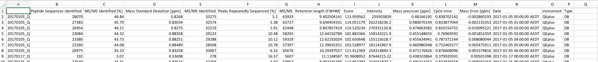

```{r setup, include=FALSE}
knitr::opts_chunk$set(echo = TRUE)
```


# About

This is a shiny application for Mass Spectrometry (Proteomics) lab at Charles Perkins Centre in University of Sydney.


# Set-up

1. Download the source codes from https://github.com/taiyunkim/QCMAP
2. Install all required R packages described in github page
3. Create the database (.csv) file by following the instruction on section 2.1.2 in `README.md` file (https://github.com/taiyunkim/QCMAP#212-database) or [here](#creating-your-own-database) in this document
4. Save the CSV file (`allFeatures.csv`) into your working directory.
5. Run `app.R`

# Shiny application

http://shiny.maths.usyd.edu.au/QCMAP/

## HeLa

This tab shows historical overview of your instrument performance.


## Predictions

This tab is used to predict quality of your experimental sample


## Database

This tab is used to generate CSV (database) file for your application. 

# How to:

## Observe and log your samples 

### Submitting your own files

### How to log and annotate events


## Prediction with your data

## Creating your own database


You will need to have database (CSV file) named `allFeatures.csv` that contains summary of the features, instrument details, filenames and dates. An example of the file headers and data is shown below.



**NOTE:** Make sure that the order of your headers are identical to the screenshot provided.

This can be generated using the [R script provided OR "Database" tab of the application at http://shiny.maths.usyd.edu.au/QCMAP/]. In order to create this file from multiple MaxQuant output files, zip the output files by studies and upload multiple zip files to combine them all together to one CSV file.

For example, given a file structure as follows,

```
./
├── study1
│   ├── Oxidation\ (M)Sites.txt
│   ├── aifMsms.txt
│   ├── allPeptides.txt
│   ├── evidence.txt
│   ├── libraryMatch.txt
│   ├── matchedFeatures.txt
│   ├── modificationSpecificPeptides.txt
│   ├── ms3Scans.txt
│   ├── msScans.txt
│   ├── msms.txt
│   ├── msmsScans.txt
│   ├── mzRange.txt
│   ├── parameters.txt
│   ├── peptides.txt
│   ├── proteinGroups.txt
│   ├── summary.txt
│   └── tables.pdf
└── study2
    ├── Oxidation\ (M)Sites.txt
    ├── aifMsms.txt
    ├── allPeptides.txt
    ├── evidence.txt
    ├── libraryMatch.txt
    ├── matchedFeatures.txt
    ├── modificationSpecificPeptides.txt
    ├── ms3Scans.txt
    ├── msScans.txt
    ├── msms.txt
    ├── msmsScans.txt
    ├── mzRange.txt
    ├── parameters.txt
    ├── peptides.txt
    ├── proteinGroups.txt
    ├── summary.txt
    └── tables.pdf

```

Compress **study1** and **study2** as separate zip files as input.


